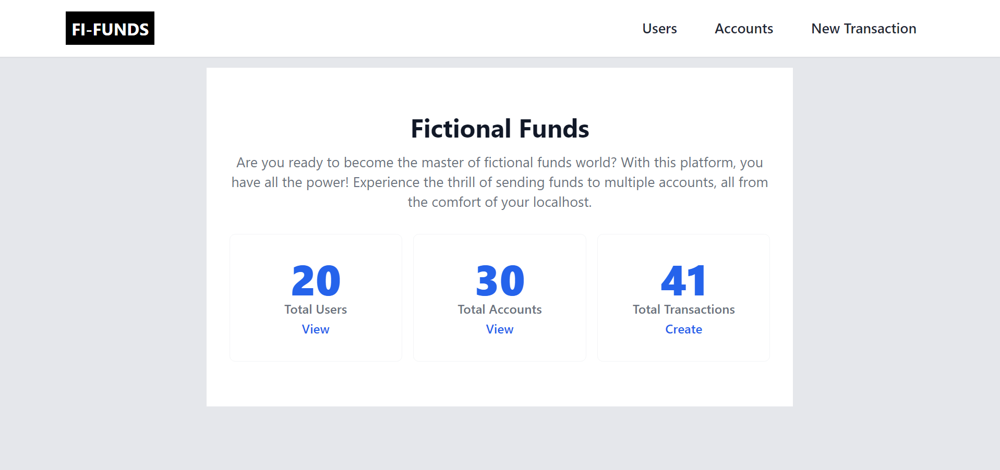
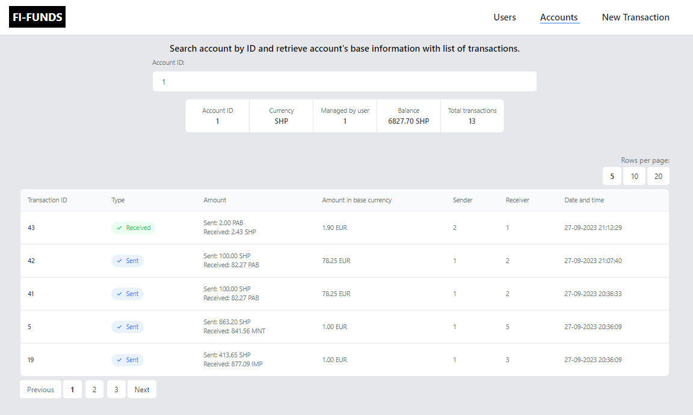
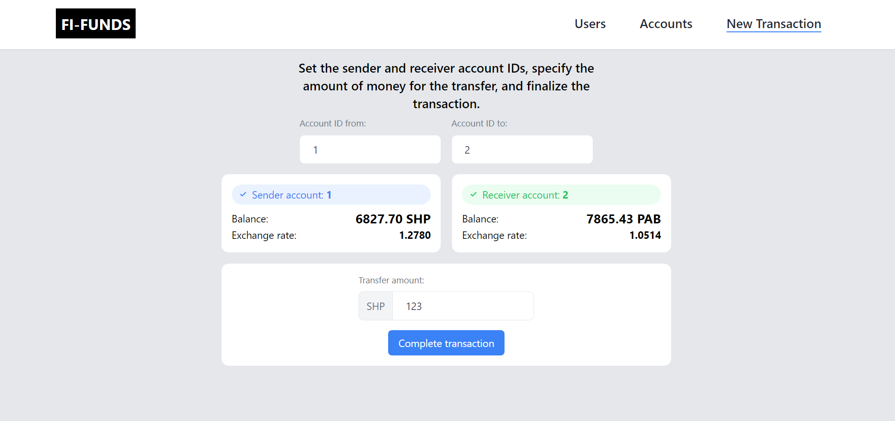

# Fictional Funds

Are you ready to become the master of fictional funds world? With this platform, you have all the power! Experience the thrill of sending funds to multiple accounts, all from the comfort of your localhost.

## Features

- Use the application to simulate financial transactions between fictional accounts
- Explore various financial scenarios and see how balances change with different operations
- Access data of users, accounts and transactions

## Prerequisites

Before you begin, ensure you have the following installed:

- PHP (>= 8.1)
- Composer
- Node.js
- Laravel 8

For using Docker:
[Docker](https://www.docker.com/) installed and running on your system.

## Installation

1. Clone the repository:
   ```
   git clone https://github.com/agnesgab/fictional-funds.git
   cd fictional-funds
   ```

2. Install PHP dependencies:
   ```
   composer install
   ```

3. Install Node.js dependencies:
   ```
   npm install
   ```

4. Copy the `.env.example` file to `.env`:
   ```
   cp .env.example .env
   ```

5. Generate an application key:
   ```
   php artisan key:generate
   ```

6. Configure your database settings in the `.env` file.
   ```
   DB_CONNECTION=mysql
   DB_HOST=127.0.0.1
   DB_PORT=3306
   DB_DATABASE=your_database_name
   DB_USERNAME=your_database_username
   DB_PASSWORD=your_database_password
   ```

7. Run database migrations:
   ```
   php artisan migrate
   ```

## Usage

1. Run scheduled tasks to fetch data from exchange rate API hourly:
   ```
   php artisan schedule:work
   ```

2. Start the Laravel development server:
   ```
   php artisan serve
   ```

3. Compile Vue.js assets:
   ```
   npm run dev
   ```

4. Access the application in your web browser locally.

## Installation and usage with Docker

1. Copy the `.env.example` file to `.env` and customize configuration settings:
   ```
   cp .env.example .env
   ```

2. Start the Docker containers for the application:
   ```
   docker-compose up -d
   ```

3. Generate an application key:
   ```
   docker-compose exec app php artisan key:generate
   ```

4. Run the database migrations::
   ```
   docker-compose exec app php artisan migrate
   ```

5. Access the application in your web browser locally.

## Testing

For running unit tests use:
```
php artisan test
```

For running unit tests using Docker use:
```
docker-compose exec app php artisan test
```

Sincerely, Agnese :relaxed:

 



